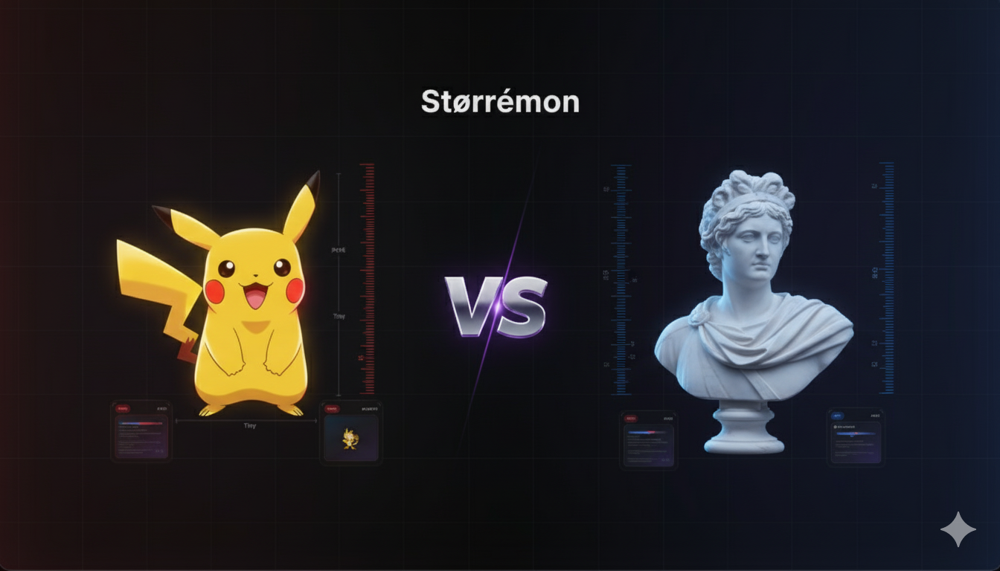

<div align="center">



# Størrémon


**An interactive size comparison tool that bridges the gaming and educational worlds.**</div>

Størrémon explores the fascinating concept of scale by allowing users to compare Pokémon and museum artifacts by their physical dimensions. Discover surprising size relationships through an intuitive, data-driven interface that combines real-world cultural artifacts with beloved digital creatures.

[](https://storremon.strm.dev/)

## Project Overview

This application was built as a React/Next.js demonstration project, showcasing:

- **Dual API Integration**: Combining PokéAPI (Pokémon data) with The Metropolitan Museum API (artwork data)
- **Interactive Data Visualization**: Dynamic size-based filtering with density heatmaps
- **Modern UI/UX**: Smooth animations, responsive design, and dual aesthetic (gaming + editorial)
- **Performance Optimization**: Aggressive caching strategies and 60fps animations

### Why This Concept?

The idea emerged from the fascinating intersection of scale perception across different domains. How does a 2-meter Charizard compare to classical sculptures? What museum artifacts share dimensions with your favorite Pokémon? Størrémon makes these abstract size relationships tangible and explorable.

## Key Features

### 🎮 **Explorer Mode** (Main Feature)

- **Scale Slider**: Continuously browse items by size (1cm to 100m+)
- **Dual Category View**: Toggle between Pokémon, Museum artifacts, or both
- **Density Visualization**: Interactive heatmap showing data distribution across size ranges
- **Smart Filtering**: Real-time data fetching with debounced API calls

### 🃏 **Interactive Cards**

- **Dual-sided Design**: Gaming aesthetic (front) meets editorial information (back)
- **3D Flip Animation**: Hardware-accelerated card flips revealing detailed metadata
- **Responsive Layout**: Optimized for both desktop and mobile experiences

### 🎲 **Game Mode** (MVP)

- Basic size comparison interface
- Placeholder for future scoring system

## Technical Architecture

### Stack Decisions

**Tech Stack**

**Frontend Framework**: Next.js 15 (App Router)

- _Why_: Full-stack capabilities with API routes, excellent TypeScript support, and built-in performance optimizations

**Styling**: Tailwind CSS v4

- _Why_: Rapid development, consistent design system, and excellent performance with purging

**State Management**: React Context + useState

- _Why_: Simple state needs met with built-in React patterns; SWR used selectively for API caching

**Animation**: Framer Motion (selective usage)

- _Why_: Used only for complex 3D card flips; simpler animations use CSS transforms for better performance

**TypeScript Throughout**

- _Why_: Better developer experience, safer refactoring, and self-documenting code

### Data Sources

**PokéAPI** - Comprehensive Pokémon database

- Heights in decimeters (converted for consistency)
- Sprite images and metadata
- 1000+ creatures with standardized data

**The Metropolitan Museum API** - Cultural artifacts

- Sculpture and artifact collections
- Dimensional data in centimeters
- High-quality images and rich metadata

### Architecture Highlights

```
┌─────────────────┐    ┌──────────────┐    ┌─────────────────┐
│   Client UI     │───▶│  API Routes  │───▶│  External APIs  │
│                 │    │   (Proxy)    │    │                 │
│ • Scale Slider  │    │ • /pokemon/  │    │ • PokéAPI       │
│ • Card Display  │    │ • /museum/   │    │ • Met Museum    │
│ • Animations    │    │ • /density/  │    │                 │
└─────────────────┘    └──────────────┘    └─────────────────┘
         │                       │
         │              ┌────────▼─────────┐
         │              │   Caching Layer  │
         └──────────────▶                  │
                        │ • React Context  │
                        │ • Local state    │
                        │ • Next.js cache  │
                        │ • Memory cache   │
                        └──────────────────┘
```

### Performance Optimizations

1. **Caching Strategy**

   - Server-side in-memory cache for API responses
   - React Context for component communication
   - SWR for selective API caching
   - CDN caching via Vercel Edge

2. **Bundle Optimization**

   - Tree-shaken dependencies
   - Strategic code splitting
   - Optimized image delivery

3. **Animation Performance**
   - Transform/opacity only for smooth 60fps
   - Hardware acceleration with `will-change`
   - Debounced API calls during slider interaction

## 🚀 Quick Start

```bash
# Install dependencies
npm install

# Run development server
npm dev

# Open http://localhost:3000
```

### Development Scripts

```bash
npm dev      # Development server with Turbopack
npm build    # Production build
npm start    # Production server
npm lint     # Code linting with Biome
npm format   # Code formatting
```

## 🎨 Design Philosophy

### Dual Aesthetic Approach

**Gaming Front**: Playful colors, smooth animations, and familiar UI patterns from gaming interfaces

**Editorial Back**: Clean typography, structured information hierarchy, and museum-quality presentation

This duality reflects the project's core concept of bridging entertainment and education.

### Design System

- **Dark-first approach**: Primary theme optimized for extended use
- **Performance-conscious animations**: Only transform/opacity for smooth 60fps
- **Responsive design**: Desktop-first with mobile optimizations
- **Accessibility considerations**: Semantic HTML, keyboard navigation support

## 🧠 Key Technical Decisions

### 1. API Proxy Pattern

**Decision**: Use Next.js API routes as proxy layer  
**Why**: Avoid CORS issues, implement caching, rate limiting, and data transformation  
**Trade-off**: Additional latency vs. reliability and control

### 2. React Context Over Complex State Management

**Decision**: Use React Context + useState for state management  
**Why**: Simple state requirements don't justify additional dependencies  
**Trade-off**: Manual optimization vs. automatic optimizations from dedicated libraries

### 3. Selective Animation Library Usage

**Decision**: Framer Motion only for complex 3D flips, CSS for everything else  
**Why**: Minimize bundle size while maintaining smooth animations  
**Trade-off**: Mixed animation approaches vs. bundle size optimization

### 4. In-Memory Caching Strategy

**Decision**: Server-side in-memory cache for external API responses  
**Why**: Reduce external API calls, improve response times  
**Trade-off**: Memory usage vs. API reliability and speed

## 📊 Performance Metrics

- **Bundle Size**: ~177KB initial (gzipped) - measured from production build
- **Time to Interactive**: Estimated <2s on desktop
- **Animation Performance**: 60fps on modern devices
- **API Response Time**: <100ms (cached), <500ms (fresh)

## 🔮 Future Enhancements

Given more development time, these features would enhance the experience:

### Technical Improvements

- [ ] **Comprehensive Test Suite**: Unit tests for core logic, integration tests for API layers
- [ ] **Advanced Error Handling**: Retry mechanisms, fallback data sources
- [ ] **PWA Implementation**: Offline support, installation prompts
- [ ] **Performance Monitoring**: Real User Monitoring (RUM) integration

### Feature Expansions

- [ ] **3D Visualizations**: Three.js integration for scale visualization
- [ ] **Additional Data Sources**: Animals, buildings, celestial objects
- [ ] **Social Features**: Share comparisons, community collections
- [ ] **Educational Content**: Size-based learning modules

### User Experience

- [ ] **Advanced Filtering**: Multiple criteria, saved searches
- [ ] **Accessibility Audit**: Full WCAG 2.1 AA compliance
- [ ] **Mobile-first Redesign**: Touch-optimized interactions
- [ ] **Personalization**: User preferences, history tracking

## 📝 Project Structure

```
storremon/
├── app/                    # Next.js App Router
│   ├── api/               # API routes (proxy layer)
│   ├── explorer/          # Explorer page route
│   ├── game/             # Game mode route
│   └── layout.tsx        # Root layout
├── components/           # React components
│   ├── ComparatorView.tsx # Main comparison interface
│   ├── ScaleSlider.tsx   # Interactive size slider
│   └── ComparisonCard.tsx # Flip card component
├── lib/                  # Utility functions
│   ├── pokemon-data.ts   # PokéAPI integration
│   └── museum-data.ts    # Met Museum API integration
├── hooks/               # Custom React hooks
└── types/              # TypeScript definitions
```

## 🎯 Development Approach

This project was built following an iterative, time-boxed approach:

1. **MVP First**: Core functionality over perfect features
2. **Performance-Conscious**: 60fps animations, aggressive caching
3. **User-Centered**: Intuitive interactions, clear visual feedback
4. **Maintainable**: Clean architecture, TypeScript throughout

The development prioritized working functionality that demonstrates technical competency while maintaining code quality and user experience standards.

## 📄 Documentation

- **[Sprint Guide](docs/project/SPRINT-GUIDE.md)**: Detailed development progress and task tracking
- **[Project Brief](docs/project/PROJECT-BRIEF.md)**: Original requirements and constraints
- **[Technical Specs](docs/project/PROJECT.md)**: In-depth architectural decisions

---

<div align="center">


**Built with ❤️ by [Jan Mirecki](https://github.com/yourusername) | [STRM.dev](https://strm.dev)**

_This project demonstrates full-stack React/Next.js development capabilities through a unique, data-driven user experience that bridges gaming and educational content._

</div>
